

  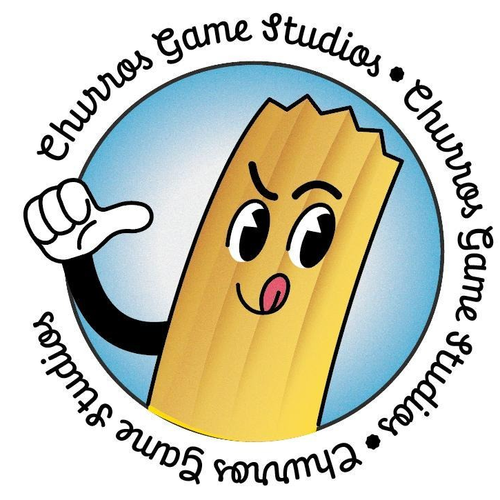
  <h1>Churros Game Studios</h1>
  
An independent game development studio based in Poland, crafting indies in the Godot Engine.

---

  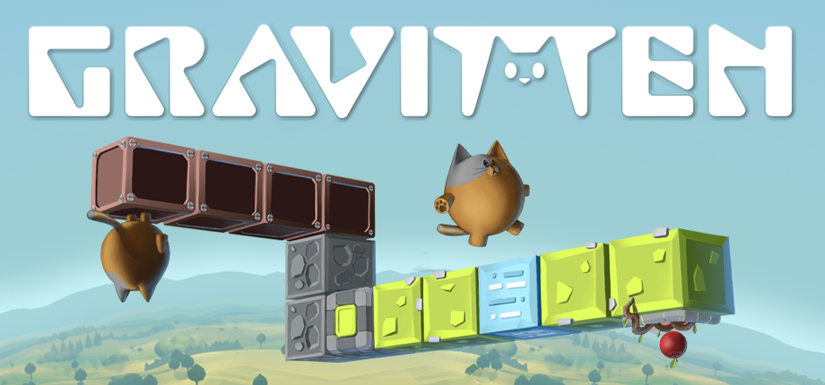

 

*Take control of Gravitten, the gravity-defying kitten, and master the environment's shifting physics. Journey through 5 distinct biomes, manipulating gravity and perspective to solve intricate puzzles.*

*   **Status:** Demo is **already released!** Full game release date: **TBA**
*   **Play the Demo:** [Download on Steam](https://store.steampowered.com/app/4199110/Gravitten)

  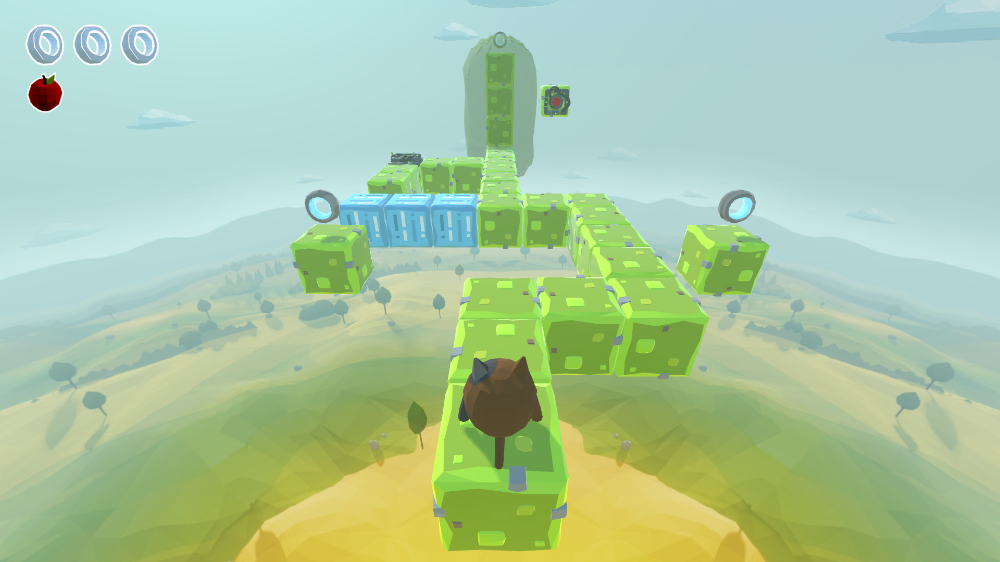
  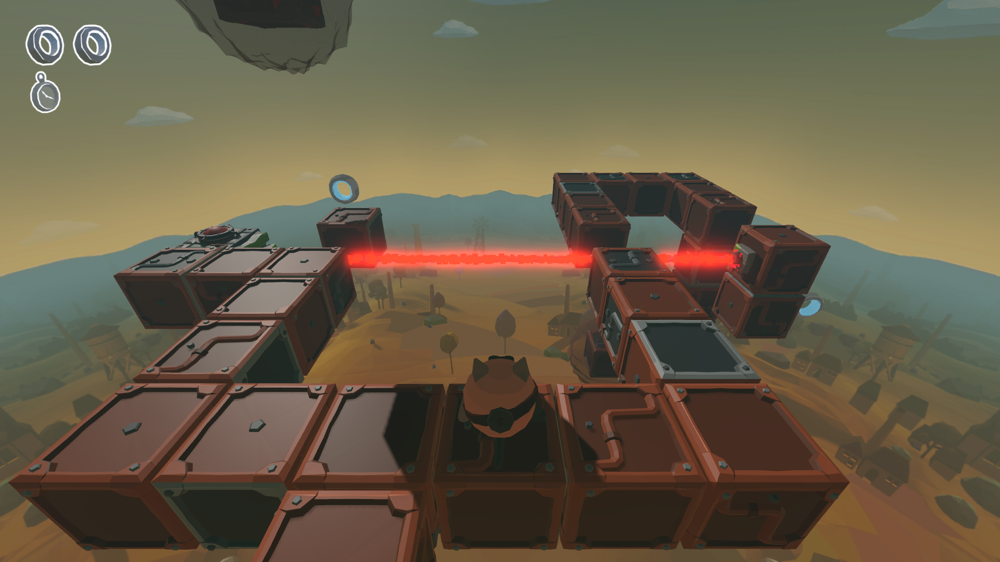
    
  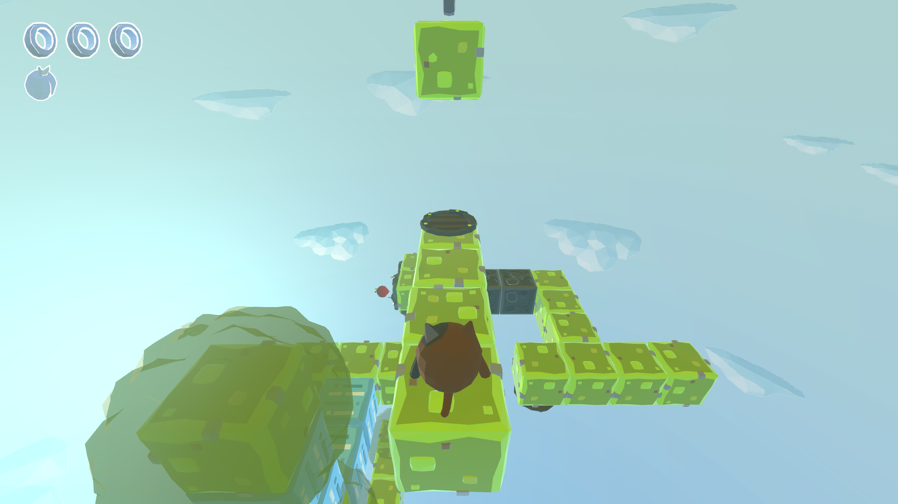
  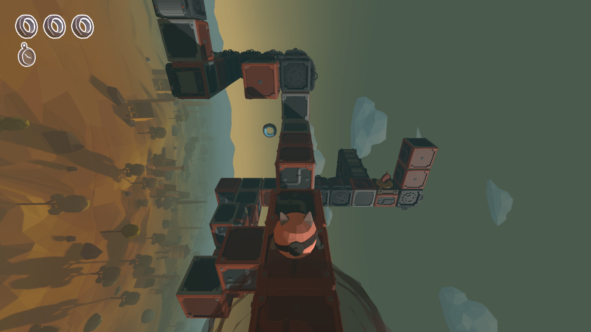

  

  

  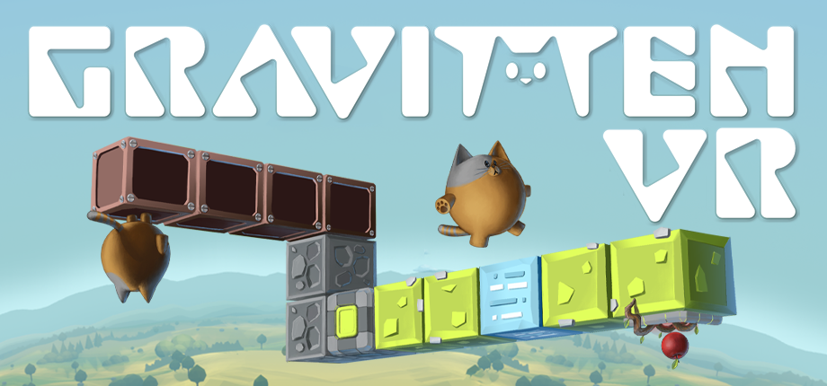

 

*Grab, climb, and turn your world upside down! Become Gravitten, the gravity-defying kitten, and master the environment's shifting physics. Experience 5 distinct biomes where up is down and left is right.*

*   **Status:** In development. Release date: **TBA**
*   **Platforms:** Steam VR and the Meta Quest ecosystem (fully supporting Meta Quest 2, Meta Quest Pro, Meta Quest 3, and Meta Quest 3S).
*   **Wishlist Now:** [Steam](https://store.steampowered.com/app/4457820/Gravitten_VR/) - [Meta Store](https://vr.meta.me/s/2a5btTd1pOup7UG)

  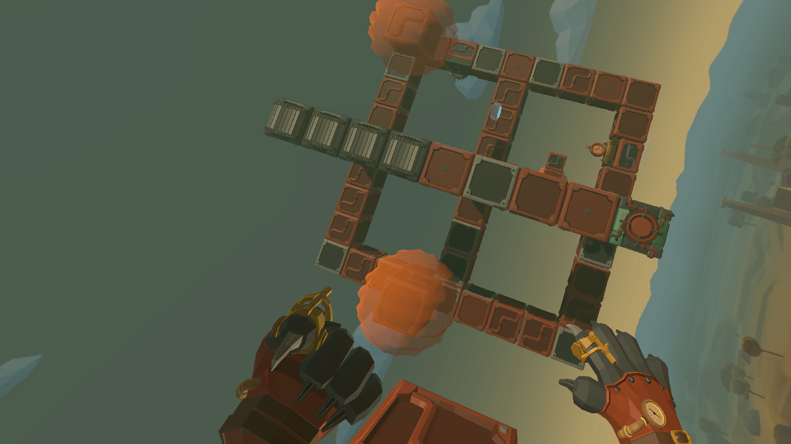
  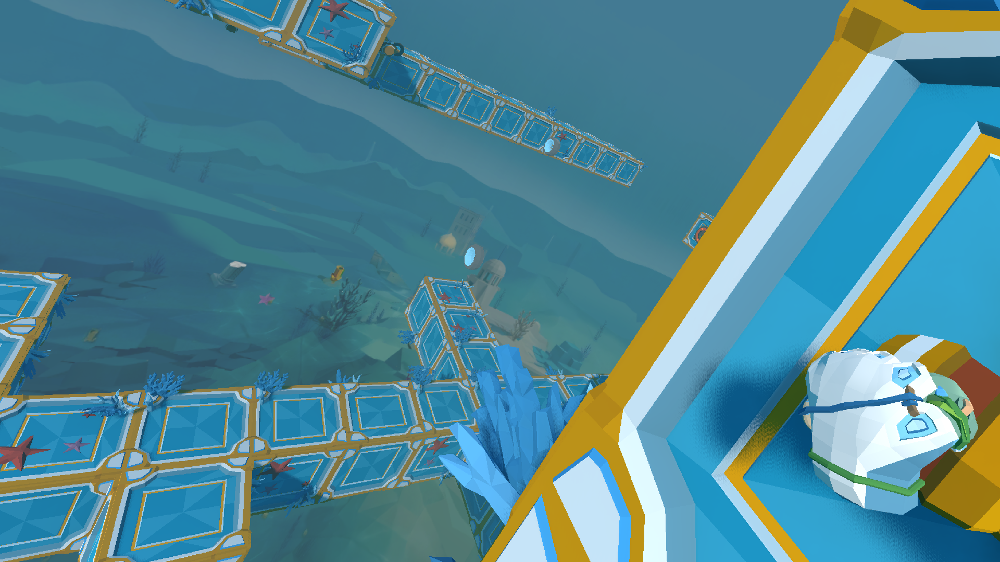
    
  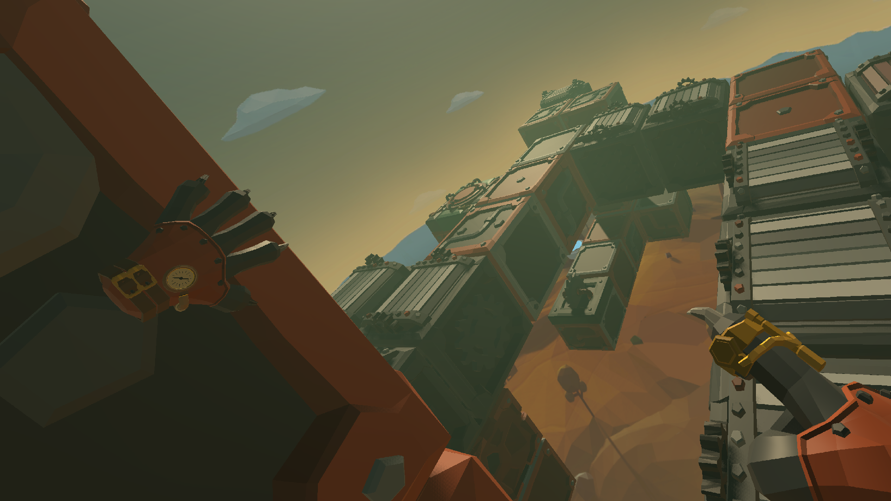
  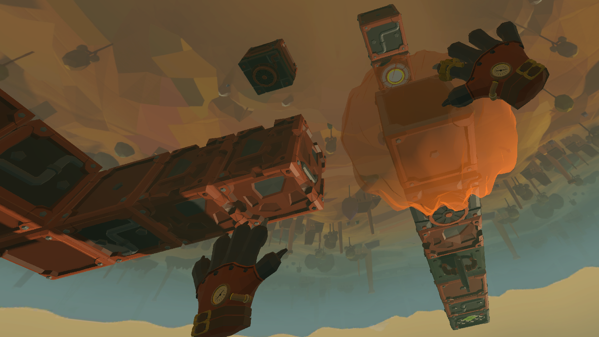

  

  

## 💬 Community & Feedback
Join our Discord server! It's the perfect place to talk about our games, share levels you've built in the level editor, or play custom levels from the community. You can also report bugs here or just drop by to chat.
*   **Discord:** [Join Churros Game Studios Discord](https://discord.gg/ncuc7FaM8a)

---

## 🛠️ Support & Contact
If you encounter any critical issues or need support, please reach out to us:
*   **Email:** churrosgamestudios@gmail.com

---

  <small>© 2026 Churros Game Studios. All rights reserved.</small>

